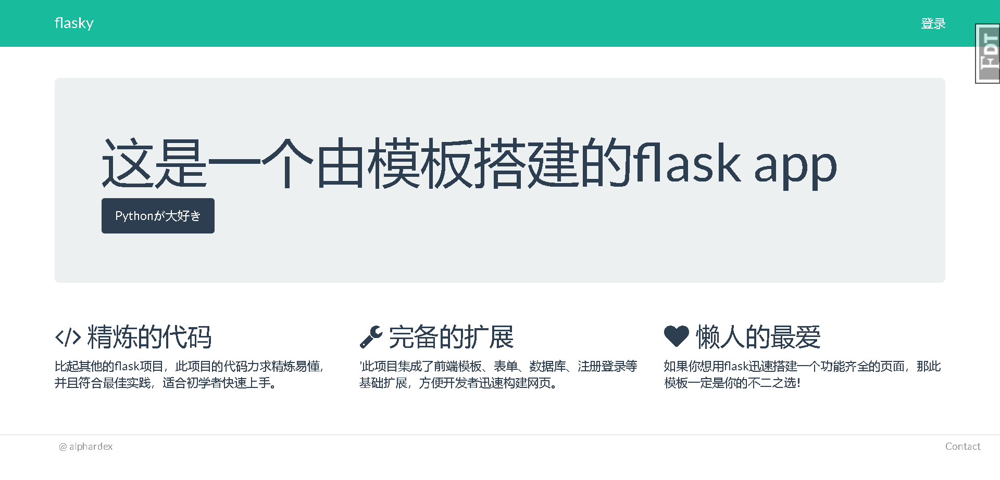

# cookiecutter-flask

一个灰常给力的flask模板。

## 快速上手

``` bash
pip install cookiecutter
cookiecutter https://github.com/alphardex/cookiecutter-flask-basic.git
```

## 预览



## 项目特征

- 前端美化：[Flask-Bootstrap](https://pythonhosted.org/Flask-Bootstrap/)
- 表单：[Flask-WTF](https://flask-wtf.readthedocs.io/)
- 数据库：[Flask-SQLAlchemy](http://flask-sqlalchemy.pocoo.org/2.3/)+[Flask-Migrate](https://github.com/miguelgrinberg/Flask-Migrate)（User Model）
- 登录注册：[Flask-Login](https://flask-login.readthedocs.io/)
- 时间规范化: [Flask-Moment](https://github.com/miguelgrinberg/Flask-Moment)
- DEBUG: [Flask-Debugtoolbar](https://github.com/mgood/flask-debugtoolbar)
- 最佳实践：[Blueprints](http://flask.pocoo.org/docs/1.0/blueprints/)以及[工厂模式](http://flask.pocoo.org/docs/1.0/patterns/appfactories)

## 灵感来源

之前在github上看到过[flask的模板](https://github.com/sloria/cookiecutter-flask)，试着搭建了一下，但是发现里面的代码有些杂乱（个人意见），于是自己重新撸了一个代码更加简洁的版本，基本的功能都可以实现。
